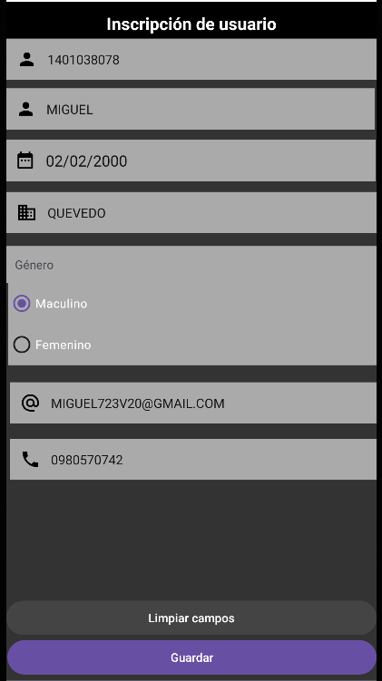
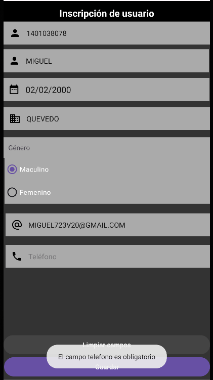
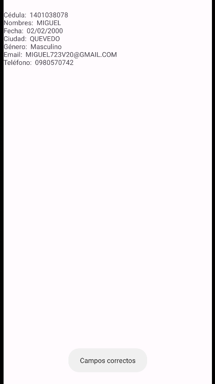

# Deber "Controles comunes" 
***

Se puede encontrar el deber dentro de la carpeta "Semana 1/Controles comunes/fistapp"

## Formulario

## Validación con Toast

## Pantalla de carga de datos

La aplicacián también borra los campos, precionando el boton "Limpiar campos"

